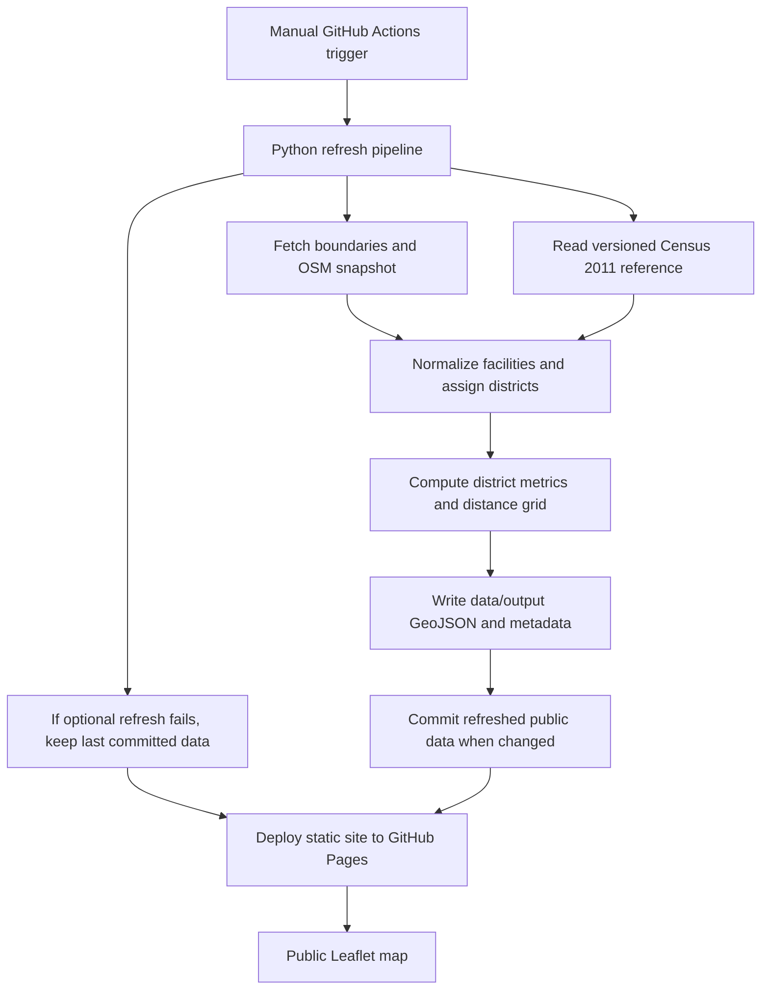

# Reproductive health access mapping: Kerala and Uttar Pradesh

A public, low-cost map for comparing mapped reproductive-health access signals across Kerala and Uttar Pradesh.

## What it does

The project publishes a static Leaflet map that displays facility points, district-level facility density, service-tag coverage, and a straight-line nearest-facility distance layer. It is designed for public access through GitHub Pages, with data refreshes run only when a maintainer manually triggers the GitHub Actions workflow.

The current data model is intentionally conservative. It combines geoBoundaries districts, a versioned Census 2011 population reference, and OpenStreetMap facility listings; it does not yet claim complete government, NGO, or private-sector facility coverage.

## Architecture



- GitHub Actions workflow: Runs the refresh and deployment sequence only when manually triggered; deploys the static shell even when an optional live source fails.
- `pipeline/refresh.py`: Orchestrates the data refresh, source reports, output files, and metadata.
- `pipeline/collect/osm.py`: Collects OpenStreetMap hospital, clinic, and doctor listings through Overpass.
- `pipeline/normalize.py`: Converts raw source records into one facility schema and normalized service tags.
- `pipeline/metrics.py`: Builds district indicators and the straight-line 5 km distance grid.
- `data/reference/census_2011_district_population.csv`: Stores the reviewed Census 2011 denominator locally because it is fixed historical data.
- `data/output/*.geojson`: Public data files consumed by the browser map.
- `site/`: Static frontend files; the browser loads GeoJSON directly, so there is no application server.

## Stack

| Layer | Technology | Why it is here |
| --- | --- | --- |
| Hosting | GitHub Pages | Free public hosting for static files. |
| Automation | GitHub Actions `workflow_dispatch` | Manual-only refreshes, matching the project requirement and avoiding scheduled compute cost; deployment continues with the last committed public data if an optional source fails. |
| Data pipeline | Python | Practical for geospatial ETL, CSV handling, and source normalization. |
| Geospatial processing | GeoPandas, Shapely, NumPy | Reads boundaries, joins points to districts, and builds derived map layers. |
| Frontend map | Leaflet, MarkerCluster, OpenStreetMap standard tiles | Lightweight static map with facility clustering and district/grid overlays; the basemap does not require an API key. |
| Data format | GeoJSON and JSON metadata | Easy for Leaflet to load directly and easy to audit in Git. |
| Source documentation | `DATA_SOURCES.md` | Keeps licences, limitations, and enabled/disabled sources visible. |

## Running it

From a clean clone:

```bash
python -m venv .venv
source .venv/bin/activate
pip install -r requirements.txt
python -m pipeline.refresh --force
mkdir -p _site/data
cp -R site/. _site/
cp -R data/output/. _site/data/
python -m http.server 8000 --directory _site
```

Then open `http://localhost:8000`.

For a cheaper local rerun, use `python -m pipeline.refresh` without `--force` so cached raw source responses can be reused. The full refresh was not rerun while writing this guide because the current known blocker is the slow or cancelled refresh path, not the static frontend.

## Decisions and tradeoffs

| Decision | Chosen | Rejected or alternative | Why / tradeoff |
| --- | --- | --- | --- |
| Deployment model | Static GitHub Pages | Backend server, database, or paid hosting | Lowest cost and easiest public access, but all computation must happen before deployment. |
| Refresh trigger | Manual GitHub Actions trigger | Scheduled refresh | Gives control over when source snapshots change and avoids surprise costs or failures. |
| Data audit trail | Commit generated public data | Store outputs only as build artifacts | Git history makes each published snapshot reviewable, but generated diffs can grow over time. |
| Population source | Versioned Census 2011 extract | Live Census workbook download every run | Census 2011 is fixed historical data, so versioning is more reliable than repeated fragile downloads. |
| Facility source baseline | OpenStreetMap via Overpass, split by state with bounded timeouts | Claiming official complete coverage or issuing one broad query | OSM is open and refreshable, but incomplete and uneven; smaller per-state queries are more reliable but still depend on public Overpass availability. |
| Distance metric | Straight-line distance grid | Road travel time | Cheap to compute and explain, but it does not capture travel barriers, road quality, cost, or safety. |
| Basemap provider | OpenStreetMap standard raster tiles | CARTO Positron basemap | Avoids exposing a public basemap API key in GitHub Pages, but it is a community-funded best-effort tile service, so the site must keep attribution visible and avoid bulk/offline tile fetching. |
| Refresh failure handling | Deploy static shell and preserve the last committed facility snapshot when OSM fails completely or any required state fails | Fail the whole deployment, publish an empty layer, or publish a one-state comparison | Makes the public URL available and honest about status while avoiding accidental data loss or misleading Kerala-vs-UP comparisons during a source outage. |
| Bright Data role | Optional enrichment layer | Replacement source of truth | It can improve private/open-web facility discovery, but listings need dedupe, provenance, and bias labels. |

## Next steps

1. Stabilize the first successful refresh.

   Completed for the current static build. OpenStreetMap collection is split into separate Kerala and Uttar Pradesh requests, refresh status is captured in source-level metadata, the workflow bounds the refresh step with a GitHub Actions timeout, and the distance grid uses a spatial index instead of comparing every grid cell against every facility. Verified manual runs now deploy the public site even when a source refresh is partial.

2. Deploy the static site shell even when fresh data fails.

   The workflow now continues past an optional refresh failure and deploys the static site with the last committed public data. If OSM fails completely and returns no records, the pipeline preserves the previous committed facility, district, and grid GeoJSON files and writes metadata with `refresh_status: failed_preserved_previous_snapshot`. If one required state fails while another succeeds, the pipeline still preserves the previous full snapshot and writes `refresh_status: partial_preserved_previous_snapshot` instead of publishing a misleading one-state comparison. The sidebar reads `refresh_status`, `refreshed_at`, `last_attempted_refresh_at`, facility counts, and source warnings from `refresh_metadata.json`.

3. Improve refresh metadata further.

   The current metadata already includes workflow run ID, git commit SHA, source-level success or failure, elapsed time, record counts, the refresh note entered in GitHub Actions, the data snapshot timestamp, and the last attempted refresh timestamp. A future pass should add record counts before and after dedupe, per-state/district sanity thresholds, and clearer machine-readable error categories.

4. Add source-quality controls.

   Add deterministic deduplication across sources, stronger district-name matching, per-state/per-district record counts, and warnings when a source returns unexpectedly few or many records.

5. Add Bright Data as an optional manual enrichment source.

   Use Bright Data only when `BRIGHTDATA_API_KEY` is available and a workflow input such as `include_brightdata=true` is selected. Store raw Bright Data results outside Git, publish only normalized facility facts, and label those records as supplemental commercial/open-web listings.

6. Add an official or NGO facility source.

   A government registry, NHM source, FPAI/Janani directory, or other vetted facility list would improve credibility more than more private directory records. Enable it only after documenting licence/terms, fields, coverage, and gaps in `DATA_SOURCES.md`.

7. Validate coverage before making claims.

   Pick one Kerala district and one Uttar Pradesh district, compare mapped facilities against a trusted reference list, and record the recall check. Until that is done, avoid claims like "complete coverage" or "X percent of facilities mapped."

8. Upgrade the map once the data is trustworthy.

   After the refresh pipeline is stable, add clearer layer labels, a source filter, district source-count panels, downloadable CSV/GeoJSON links, and a visible "last refreshed" badge.

9. Add basic automated checks.

   Add tests that verify the pipeline writes valid GeoJSON, metadata has required fields, districts have population matches where expected, and the frontend can load all required output files.

10. Decide the public data policy.

   Before publishing Bright Data or private-directory-derived records, decide which fields are safe and useful to expose. A conservative public dataset should include facility name, broad type, source, district, coordinates when allowed, and retrieval timestamp, while avoiding unnecessary contact details or scraped page text.
